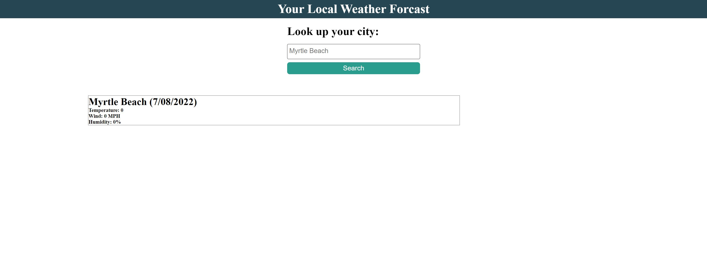

# What's-The-Weather

## Description

This was a code assignment utilizing  HTML, CSS, Javascript, Jquery, and Bootstrap to create a webstite that would allow the user to submit their a desired location which would then grab their location from their local storage and show the user the weekly forecast for the location they picked.
The motivation for building this project was pushing the boundaries on my knowledge of bootstrap and jquery and attempt to utilize the information we were given over the week. Although I decided to take my teacher's advice and focus on our first collaborative project, I did try to put some time and effort into setting up the page somewhat in html and css and still plan to myself how I would approach it using javascript and bootstrap and submit what I have and come back to it when I have the time.
I did learn and increase my understanding of wireframing, project planning, and psuedocoding to breakdown the project and see how I could approach it. Even though I didn't fully complete this project I still feel like I learned a alot and increased my understanding of bootstrap and javascript by talking it through and planning it out with myself.

## Usage

The use of this page is to use as way to enter in the name of a city and have it provide you with the weekly forecast.

## GitHub Repository

The Links below will take you to the Repository page for this challenge as well as the deploy link to see the final product!

-Repository URL: https://github.com/thenoahac/whats-the-weather/settings/pages

-Deploy URL: https://thenoahac.github.io/whats-the-weather/

## Site Image

## Credits

-Thank you to Chris Le for talking about how to utilize bootstrap and explaining it to me!

-Thank you to Annie Hosch on collabing with me on a general project structure
